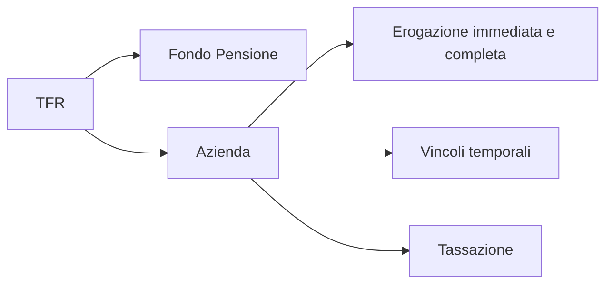

# TFR - Trattamento fine rapporto (liquidazione)

- il datore di lavoro è obbligato per legge a mettere da parte questa somma (TFR annuale === 6,91% della RAL)
- il TFR lo hanno solo i dipendenti
    - P.IVA non lo hanno

## Domande

# Sources

- www.youtube.com/watch?v=N0N3LjZSLEU
