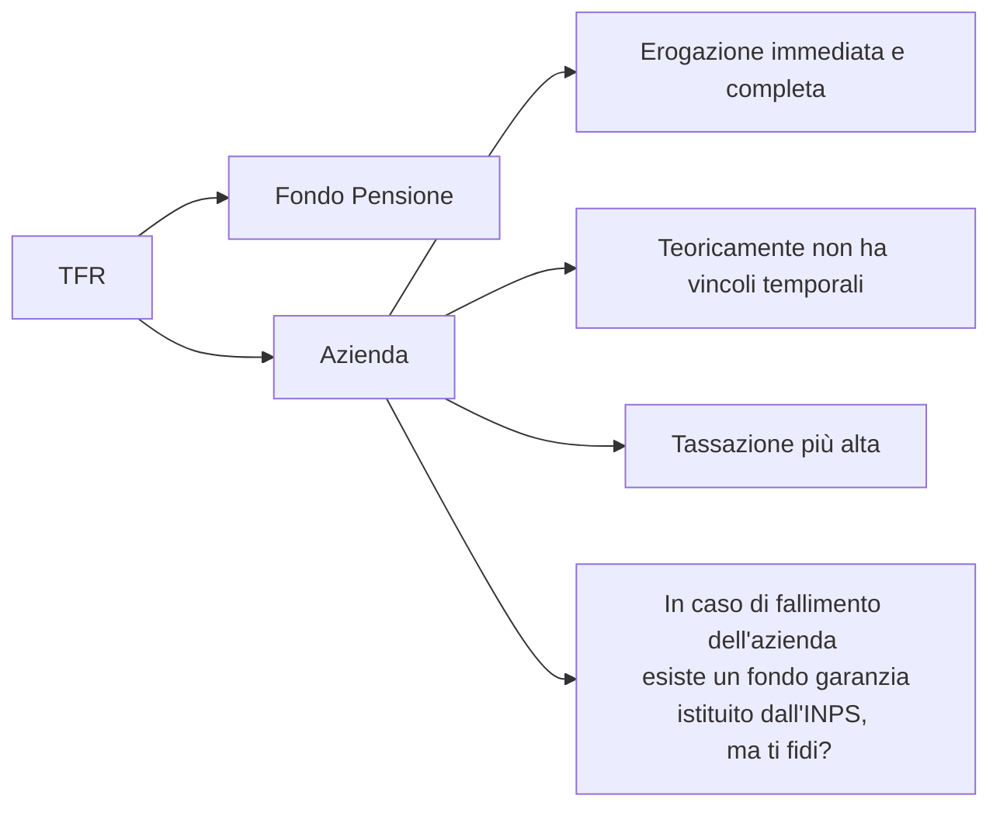

# TFR - Trattamento fine rapporto (liquidazione)

- [Anche in caso di fallimento dell'azienda, ma non solo](https://www.inps.it/it/it/dettaglio-scheda.schede-servizio-strumento.schede-servizi.50186.fondo-di-garanzia-del-tfr-e-dei-crediti-di-lavoro.html)
- il datore di lavoro è obbligato per legge a mettere da parte questa somma (TFR annuale === 6,91% della RAL)
- il TFR lo hanno solo i dipendenti
    - P.IVA non lo hanno
- per ora il problema, in questo contesto, dell'Italia, è l'INPS
    - 23 milioni di lavoratori che pagano le tasse su 60 milioni di persone

## Domande

# Sources

- www.youtube.com/watch?v=N0N3LjZSLEU
